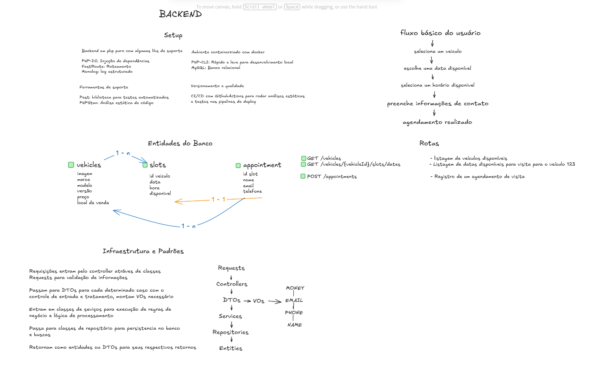

# Teste Técnico Loop – Sistema de Agendamento de Visitas

Sistema de agendamento de visitas para veículos, desenvolvido como teste técnico para a vaga de Engenheiro(a) Full-Stack. A aplicação utiliza backend em PHP com arquitetura limpa, frontend em React + MUI e infraestrutura containerizada com Docker.

## Sobre o Projeto

O sistema permite que usuários:
- Consultem veículos disponíveis
- Visualizem horários de agendamento
- Realizem agendamentos de visita através de uma API REST

---

## Deploy

- **Frontend (Vercel):** https://loop-teste-tecnico.vercel.app/
- **Backend (Railway):** https://loop-teste-tecnico-production.up.railway.app/api/v1/health

---


## Tecnologias Utilizadas

### Backend
- **PHP 8.3** — Linguagem base da aplicação
- **Composer** — Gerenciamento de dependências
- **PHP-DI** — Container de injeção de dependências
- **FastRoute** — Biblioteca de roteamento
- **Pest** — Framework de testes automatizados
- **Mockery** — Criação de mocks para testes unitários
- **php-dotenv** — Gerenciamento de variáveis de ambiente
- **PDO** — Camada nativa de acesso ao MySQL

### Frontend
- **React + Vite** — Base da interface
- **TypeScript** — Tipagem estática
- **Material UI (MUI)** — Sistema de componentes e design
- **Emotion** — Engine de estilização do MUI
- **React Router DOM** — Roteamento da aplicação
- **React Query** — Gerenciamento de estado e cache

### Infraestrutura
- **MySQL 8** — Banco de dados relacional
- **Docker Compose** — Orquestração de containers
- **phpMyAdmin** — Interface web para gerenciamento do banco
- **Railway** — Hospedagem do backend
- **Vercel** — Hospedagem do frontend

---

## Postman Collection

A API possui uma coleção do Postman para facilitar os testes durante o desenvolvimento.

O arquivo está no formato JSON e pode ser importado diretamente no Postman.

**[🔗 Acessar Coleção Postman](./docs/postman-collection.json)**

### Como testar usando o Postman

- Abra o Postman
- Clique em Import
- Selecione o arquivo postman-collection.json
- A coleção será carregada automaticamente
- As rotas já estão configuradas com a variável {{url}} apontando para o ambiente de produção:

---

## Testes e Análise Estática

### Executando Testes (Pest)

Os testes automatizados garantem a qualidade e confiabilidade do código.

```bash
cd backend
composer test
```

### Executando Análise Estática (PHPStan)

A análise estática detecta erros de tipagem e garante boas práticas.

```bash
cd backend
composer stan
```

> 💡 Ambos os comandos são executados dentro do container Docker através de scripts definidos no `composer.json`, garantindo consistência entre ambientes.

---

## Como Executar o Projeto

### Início Rápido

Execute o script de setup que configura todo o ambiente automaticamente:

```bash
./setup.sh
```

Este comando irá:
- ✅ Subir todos os containers (API, MySQL, phpMyAdmin e Frontend)
- ✅ Instalar dependências do backend
- ✅ Executar migrações do banco de dados
- ✅ Popular o banco com dados iniciais (seeders)
- ✅ Deixar o ambiente completamente pronto para uso

---

## Decisões Arquiteturais

### Separação de Responsabilidades
Utilização clara de Domain, Infrastructure, Application e camada de Interface (API).

### Value Objects
Garantia de consistência e validação automática através de:
- Email
- Preço
- Localização
- Horário (SlotHour)

### DTOs para Entrada de Dados
Evita acoplamento e garante validação de inputs antes de chegar no domínio.

### Repository Pattern
Abstração do acesso ao banco de dados, permitindo troca de implementação futura.

### Inversão de Dependência (PHP-DI)
Domínio completamente desacoplado dos detalhes de infraestrutura.

### Frontend Desacoplado
- Hooks dedicados para operações da API
- React Query para cache, loading e tratamento de erros
- Componentes reutilizáveis e modulares

---

## Diagrama de Arquitetura e Fluxo

Antes de iniciar o desenvolvimento, foi criado um diagrama no Excalidraw para organizar as entidades, relacionamentos, fluxo de informações e as principais decisões arquiteturais do sistema.

Isso ajudou a estruturar:

- entidades do domínio (Vehicle, Slot, Appointment, Location)
- fluxo do usuário no front-end
- dependências entre serviços
- endpoints da API
- responsabilidades de cada camada
- regras de negócio relacionadas a datas e horários

**Diagrama (Excalidraw):**  


> Durante o desenvolvimento algumas escolhas foram repensadas, este diagrama representa o planejamento inicial do projeto.


## CORS – Política de Origem Liberada

Por questões de segurança, o backend implementado neste projeto não aceita requisições de qualquer origem.

Atualmente, o CORS está configurado para permitir apenas duas origens:

- http://localhost

Usado no ambiente de desenvolvimento com Vite.

E o domínio do frontend hospedado na Vercel
Definido via variável de ambiente FRONTEND_URL.